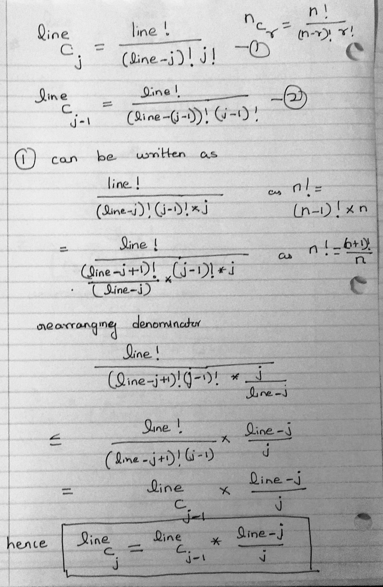

Pascal's Triangle
===========================================================================
Pascal’s triangle is a triangular array of the binomial coefficients. Write a function that takes an integer value n as input and prints first n lines of the Pascal’s triangle. Following are the first 6 rows of Pascal’s Triangle.

			1  
			1 1 
			1 2 1 
			1 3 3 1 
			1 4 6 4 1 
			1 5 10 10 5 1 
Key Points
====================

1. Math is very essential. Key concepts to know Binomial Coeff

2. Look for expressing any terms as a multiple or derivative of previous steps
    Here 
    
    line          line
    	C    = 		  C	      * (line-j)/j
    	 j				j-1

Derivation
 
Key Questions to Ask
====================
1. 

Approaches
====================

1. Three approaches possible
..1 Brute Forxe- Keep calculating binomial coeff for every entry O(n3) inefficient ( Two for loops and one loop to calculate binomial coff)
..2 Using Arrays
        a`[i][j]=a[i-1][j-1]+a[i-1][j]`; for all i!=0 and i!=j
    This is O(n2) but uses O(n2) space
..3 Keep a running product using the formula derived above		 

Sample Output
=====================
Case 1 Happy path
6

1 
1 1 
1 2 1 
1 3 3 1 
1 4 6 4 1 
1 5 10 10 5 1 

References
====================
http://www.geeksforgeeks.org/pascal-triangle/

