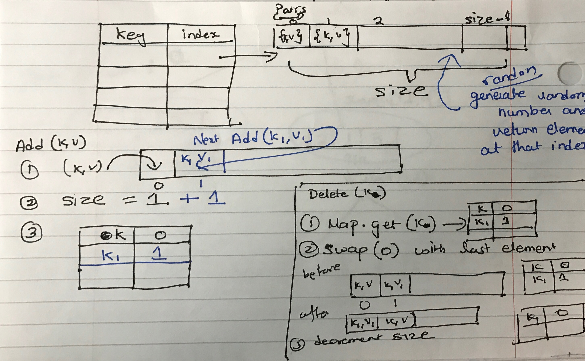

Magic Map
===========================================================================
Hash Map or ordered map adheres to  the following interface

 * get(key) - O(1) - Gets a value for key K
 * set(key,value) - O(1) - Sets/Updates the value for key
 * delete(key) - O(1) - Deletes the key 
 * getKeys - O(n)
 * getValues - O(n)
 
 
 Create a magic map that complies to that interface and Implement a get_random function that retruns a random value in O(1)

<div style="page-break-after: always;"></div>

Key Points
====================

1. More often than not, any solution could easily violate the contract for any of the other APIs
2. <b> Make sure all the APIs work before presenting the solution</b>
3.<b>Note: We are not deleting an element from the array but implementing delete by managing the "size" </b>


Key Questions to Ask
====================
1. What all do I have access to? ( eg will there be a random function given)

Approaches
====================

Implement the magic map with following data structures
- Maintain an array of the key value pairs
- Have a map with "key" as key and the index of the key value pair in the array as value


<b>Note: We are not deleting an element from the array but implementing delete by managing the "size" </b>

get_random will get a random number and return the value at its index
``` java

    ArrayList<Pair> pairsList = new ArrayList<>();
	AtomicInteger size = new AtomicInteger();
	HashMap<Object, Integer> map = new HashMap<>();
	
	//Delete
	int index= map.get(key);
		//swap the element of the index with the last element
		Pair pairAtEnd=pairsList.get(size.get()-1);
		swap(index,size.get()-1);
		//Update in the map
		map.put(pairAtEnd.getKey(), index);
		//reduce size of the list
		size.decrementAndGet();
		//remove the element from the map
		map.remove(key);

```
<div style="page-break-after: always;"></div>

References
====================


