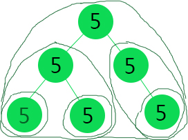

Single Value Tree
===========================================================================
Given a binary tree, we need to count the number of unival subtrees (all nodes that have the same value). 
 
e.g. Given the following tree, it has 6 unival subtrees.

 

Key Points
====================

1. Use atomic int or a custom type for keeping running count as java is call by value
1. Leaf nodes by itself are unival

Key Questions to Ask
====================
1. 

Approaches
====================

1. Recursively check for unival nodes
1. I am unival node if I am the leaf node
1. I am also an unival node if my left and right are unival and my value is = either left or rights value
1. If only one of right or left node is present, I am unival if my right or left is unival and my value is equal to its value

	

2. Time complexity O(n)
3. Space complexity O(logn) for recursion 
References
====================

https://crazycoderzz.wordpress.com/count-the-number-of-unival-subtrees-in-a-binary-tree/